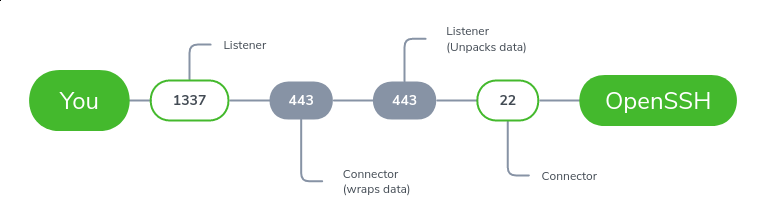

# ftunnel
stunnel but written in Python.. and more flexability to wrap data in other ways.

# HOWTO

Where you're coming from:

    python ftunnel.py --source=:1337 --destination=hvornum.se:443 --http=destination

Where you're going:

    python ftunnel.py --source=:443 --destination=127.0.0.1:22 --http=source

Then simply point for instance OpenVPN towards `127.0.0.1:1337`.

This will create a transparent/passive tunnel, masking the traffic coming in on `--source` as a HTTP `POST` request while it's being transmitted between two ftunnel sessions. And the destination will extract the original traffic before sending it to it's `--destination`.

# Parameters

    --http=<source|destination>
      Tells ftunnel if the [incoming] data should be [unwrapped]
      or if [destination] traffic should be [wrapped] before sending.
    
    --source=[IP]<:PORT>
      Which port (and/or IP) to listen on.
    
    --destination=<IP:PORT>
      Where to relay the data passively. I say passively because the original
      data is never touched.
      
    --pem=[./path/to/key+cert.pem]
      Supply a custom key & cert pair (pem format for now)
      TODO: Just generate one in runtime if one ain't supplied.

